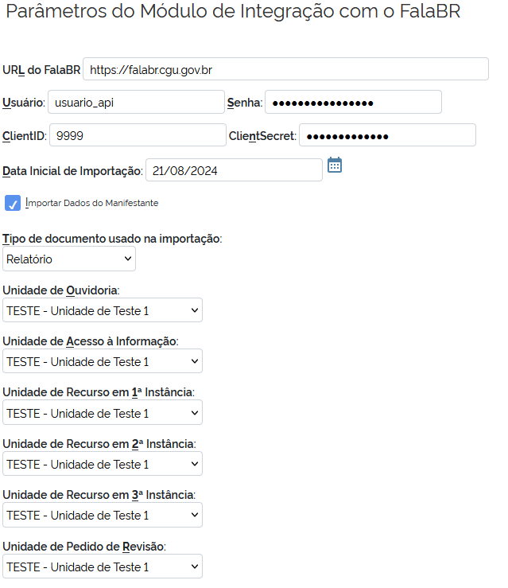

# Módulo de Integração SEI & FalaBR

## Requisitos

- SEI versão 4.0.3 ou superior (verificar versão no arquivo /sei/web/SEI.php).

- Utilizar o Sistema FalaBR do Governo Federal. Caso ainda não tenha aderido ao FalaBR e queira saber mais informações acesse https://falabr.cgu.gov.br/.

- [IMPORTANTE] Ao executar os scripts de instalação/atualização (seção [Executar scripts](#executar-scripts) abaixo), você precisará informar um usuário e senha para se conectar ao banco de dados do SEI e do SIP. Tal usuário precisa ter permissão de acesso total, sendo capaz de criar e excluir tabelas.

## Instalação/atualização e configuração

### Procedimentos antes da instalação

Fazer backup completo dos bancos de dados do SEI e do SIP.

### Download do módulo

Baixar o arquivo integracao-falabr-VERSAO.zip da versão desejada na página: https://github.com/cgugovbr/mod-sei-eouv/releases
 
A estrutura de pastas do arquivo zip é a seguinte:

```bash
./
 --/sei
 --/sip
 --/README.md
```
  
> Os arquivos contidos dentro dos diretórios sei e sip não substituem nenhum código-fonte original do sistema. Eles apenas posicionam os arquivos do módulo nas pastas corretas de *scripts* e *modulos*.
  
### Copiar arquivos

Copie o arquivo zip para o servidor do SEI e descompacte-o na raiz de instalação do sistema usando o comando abaixo:
  
```bash
$ cd <DIRETORIDIO_RAZ_DE_INSTALAÇÃO_DO_SEI>
$ unzip integracao-falabr-VERSAO.zip
```

> Lembre-se de substituir o termo **'VERSAO'** pelo nome do arquivo zip com a versão que está sendo instalada.

Os arquivos serão colocados nas pastas */sip/scripts*, */sei/scripts* e */sei/web/modulos/cgu/mod-sei-eouv*
 
### Instalação/atualização

#### Habilitar módulo

Caso esteja instalando pela primeira vez o módulo, adicionar a linha **'MdCguEouvIntegracao' => 'cgu/mod-sei-eouv'** no *array* 'Modulos' do arquivo */sei/config/ConfiguracaoSEI.php* conforme abaixo:

```text
'SEI' => array(
	'URL' => 'http://[Servidor_PHP]/sei',
	'Producao' => false,
	'RepositorioArquivos' => '/var/sei/arquivos',
	'Modulos' => array(
		[...],
		'MdCguEouvIntegracao' => 'cgu/mod-sei-eouv',
	)
),
```

> Utilize sempre editores de texto que não alterem o *charset* do arquivo

#### Executar scripts

Execute os *scripts* '*/sip/scripts/md_cgu_eouv_atualizar_modulo.php*' e '*/sei/scripts/md_cgu_eouv_atualizar_modulo.php*' em linha de comando no servidor do sistema, verificando se não houve erro durante a execução. Ao final deve aparecer a mensagem "FIM".

Para executar os *scripts* digite os comandos a seguir:

```bash
/usr/bin/php -c /etc/php.ini sip/scripts/md_cgu_eouv_atualizar_modulo.php > md_cgu_eouv_atualizar_modulo_sip.log
/usr/bin/php -c /etc/php.ini sei/scripts/md_cgu_eouv_atualizar_modulo.php > md_cgu_eouv_atualizar_modulo_sei.log
```

> **[IMPORTANTE]** Ao final da execução de cada um dos *scripts* acima deve constar o termo "FIM" e informação de que a instalação ocorreu com sucesso (SEM ERROS). Do contrário, o script não foi executado até o final e algum dado não foi inserido/atualizado nos bancos de dados correspondentes. Neste caso, deve-se restaurar o backup do banco pertinente e repetir o procedimento.

> Constando o termo "FIM" e a informação de que a instalação ocorreu com sucesso, pode logar no SEI e verificar no menu *Infra > Módulos* se consta o módulo "Módulo de Integração entre o sistema SEI e o FalaBR (Sistema de Ouvidorias - e-Ouv|e-Sic)" com o valor da última versão do módulo.

### Configurações

Parametrizar o módulo, usando o usuário com perfil "Administrador" do SEI, conforme descrito a seguir.

**Atenção!** Se estiver atualizando da versão 4.0.2 ou anterior é **obrigatório**
refazer os passos de configuração, pois foram feitas alterações significativas
nas configurações.

#### Tipos de Manifestação

Acessar o menu *Administração -> Integração com FalaBR -> Tipos de Manifestação* e associar cada tipo de manifestação do FalaBR com um tipo de processo existente no SEI. Você poderá criar um novo tipo de processo para cada tipo de manifestação do FalaBR se for o caso.

Abaixo estão os tipos de manifestações do FalaBR que serão importadas para o SEI:

| ID FalaBR                | Tipo de Manifestação |
| :-:                      | :-:                  |
|1                         |Denúncia              |
|2                         |Reclamação            |
|3                         |Elogio                |
|4                         |Sugestão              |
|5                         |Solicitação           |
|6                         |Não Classificada      |
|7                         |Comunicado            |
|8                         |Acesso à Informação   |

> Obs: manifestações do tipo "Simplifique" não são suportadas.

Caso não deseje importar algum tipo de manifestação, desative o tipo correspondente
usando o botão na coluna de *Ações*.


Os tipos desativados ficam com a linha toda vermelha.

#### Parâmetros

Acessar o menu *Administração -> Integração com FalaBR -> Parâmetros da Integração* e preencha o formulário:



Explicação dos campos do formulário:
- **URL do FalaBR**: URL do sistema FalaBR. Em produção, usar o valor https://falabr.cgu.gov.br.
Em ambientes de teste usar o valor https://treinafalabr.cgu.gov.br.
- **Usuário**: Nome de usuário para acesso aos WebServices do FalaBR, gerado especificamente para cada órgão.
Caso ainda não possua este usuário, solicitar via formulário para o
[Suporte Técnico do Fala.BR](https://formularios.cgu.gov.br/index.php/679625?lang=pt-BR).
- **Senha**: Senha do usuário para acesso aos WebServices do FalaBR.
- **ClientID**: ID gerado para acesso aos WebServices.
- **ClientSecret**: Senha gerada para acesso aos WebServices.
- **Data inicial de Importação**:  Data a partir da qual as manifestações devem
ser importadas. Sugerimos que seja colocada a **data da instalação** para que apenas as
novas manifestações sejam importadas para o SEI.
- **Importar dados do manifestante**: Marque para importar os dados pessoais da
pessoa que enviou a manifestação para o processo SEI, caso eles estejam visíveis
para o órgão.
- **Tipo de documento usado na importação**: Quando a rotina de importação for
executada, será gerado um documento PDF com os dados da manifestação. Este documento
será anexado ao processo. Este campo indica o Tipo de Documento SEI que será
utilizado para este PDF. Lembrando que deve ser do Grupo de **Documentos Externos**.
Para verificar os tipos existentes acesse *Administração > Tipos de Documento > Listar*.
- **Unidade de Ouvidoria**: Unidade no SEI que deverá receber os processos
oriundos de manifestações de Ouvidoria importados do FalaBR.
- **Unidade de Acesso à Informação**: Unidade no SEI que deverá receber os processos
oriundos de pedidos de Acesso à Informação importados do FalaBR.
- **Unidade de Recurso em 1ª Instância**: Unidade no SEI que deverá receber os
processos quando houver recurso de **primeira** instância.
- **Unidade de Recurso em 2ª Instância**: Unidade no SEI que deverá receber os
processos quando houver recurso de **segunda** instância.
- **Unidade de Recurso em 3ª Instância**: Unidade no SEI que deverá receber os
processos quando houver recurso de **terceira** instância.
- **Unidade de Pedido de Revisão**: Unidade no SEI que deverá receber os
processos quando houver pedido de **revisão**.

#### Agendamento

O script de instalação já cria o agendamento **MdCguEouvAgendamentoRN::executarImportacaoManifestacaoFalaBr**,
responsável por realizar a importação e atualização dos processos.

Ajuste a periodicidade de execução do agendamento no menu *Infra > Agendamentos*.
> Sugerimos que os agendamentos sejam executados uma vez por dia

## Orientações Gerais

Em caso dúvidas favor enviar um email para [DISOL - disol@cgu.gov.br](mailto:disol@cgu.gov.br?subject=[DUVIDA]%20SEI%20-%20módulo%20FalaBR)
